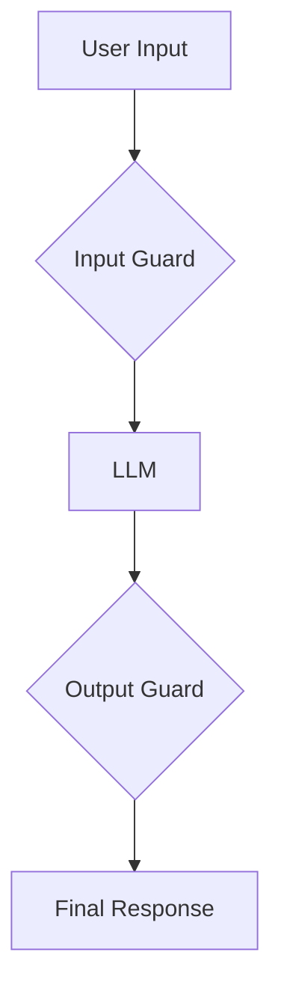

# Guardrails AI Integration

This document outlines the process of integrating Guardrails AI with the NeuroLink platform to enhance the safety, reliability, and security of AI-powered applications.

## Overview

Guardrails AI is an open-source library that provides a framework for creating and managing guardrails for large language models (LLMs). By integrating Guardrails AI, developers can enforce specific rules and policies on the inputs and outputs of their models, ensuring that they adhere to safety guidelines and quality standards.

## Key Benefits

- **Risk Mitigation**: Protect against common AI risks such as hallucinations, toxic language, and data leakage.
- **Quality Assurance**: Ensure that model outputs are accurate, relevant, and meet predefined quality criteria.
- **Compliance**: Enforce industry-specific regulations and compliance requirements.
- **Customization**: Create custom guardrails tailored to specific use cases and business needs.

## Implementation Strategy

The integration of Guardrails AI into the NeuroLink platform will follow these steps:

1.  **Installation**: Add the Guardrails AI library as a dependency to the project.
2.  **Configuration**: Define the necessary configurations to connect to the Guardrails AI service.
3.  **Integration**: Incorporate Guardrails AI into the AI provider workflow to validate model inputs and outputs.
4.  **Documentation**: Provide comprehensive documentation on how to use Guardrails AI with NeuroLink.

## Pre- and Post-Processing with Guardrails

Guardrails AI can be used to create a robust validation pipeline that acts as both a pre-filter for inputs and a post-filter for outputs. This ensures that the data sent to the LLM is valid and that the generated response meets the required quality standards.

### Input Guard (Pre-processing)

The Input Guard is responsible for validating the user's input before it is sent to the LLM. This can include checks for:

- **PII Detection**: Ensure that no personally identifiable information is sent to the model.
- **Topic-based Filtering**: Restrict the conversation to specific topics.
- **Language Detection**: Ensure that the input is in a supported language.

### Output Guard (Post-processing)

The Output Guard is responsible for validating the LLM's response before it is sent to the user. This can include checks for:

- **Toxicity Detection**: Ensure that the response is not toxic or offensive.
- **Fact-checking**: Verify that the information in the response is accurate.
- **Format Validation**: Ensure that the response is in the correct format (e.g., JSON, XML).

## Structured Data Generation

Guardrails AI can also be used to generate structured data from LLMs. This is particularly useful when you need to extract specific information from a user's request and format it in a structured way.

For example, you can define a Pydantic model that represents the desired output structure, and Guardrails AI will use it to guide the LLM in generating the correct output.
