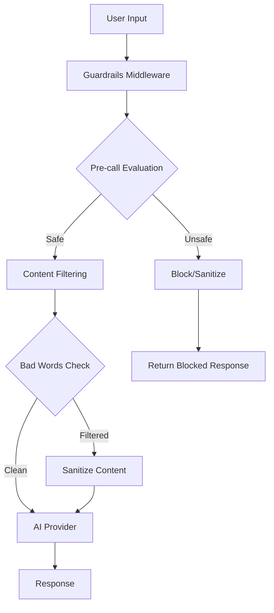

# Guardrails Implementation Guide

This document provides comprehensive documentation for the NeuroLink guardrails implementation, including pre-call filtering, content sanitization, and AI-powered evaluation.

## Overview

The guardrails implementation provides advanced content filtering and safety mechanisms for AI interactions. It includes:

- **Pre-call Evaluation**: AI-powered safety assessment before processing
- **Content Filtering**: Bad words and regex pattern filtering
- **Parameter Sanitization**: Input cleaning and modification
- **Evaluation Actions**: Configurable responses (block, sanitize, warn, log)
- **Visual Proof**: Screenshots demonstrating filtering in action

## Architecture



## Core Components

### 1. Guardrails Middleware (`src/lib/middleware/builtin/guardrails.ts`)

The main middleware component that orchestrates all guardrail functionality:

```typescript
import { GuardrailsMiddleware } from "@neurolink/middleware";

// Apply guardrails to any AI provider
const guardedModel = new GuardrailsMiddleware(baseModel, config);
```

### 2. Guardrails Utilities (`src/lib/middleware/utils/guardrailsUtils.ts`)

Core utility functions for evaluation and filtering:

- `performPrecallEvaluation()` - AI-powered safety assessment
- `applyEvaluationActions()` - Execute configured actions based on evaluation
- `applySanitization()` - Clean and modify request parameters
- `applyContentFiltering()` - Filter content using patterns and word lists

### 3. Type Definitions (`src/lib/types/guardrails.ts`)

Complete TypeScript interfaces for configuration and results:

```typescript
interface GuardrailsMiddlewareConfig {
  badWords?: BadWordsConfig;
  modelFilter?: ModelFilterConfig;
  precallEvaluation?: PrecallEvaluationConfig;
}
```

## Configuration

### Basic Configuration

```typescript
const guardrailsConfig = {
  precallEvaluation: {
    enabled: true,
    provider: "google-ai",
    evaluationModel: "gemini-1.5-flash",
  },
  badWords: {
    enabled: true,
    list: ["inappropriate", "harmful"],
  },
};
```

### Advanced Configuration

```typescript
const advancedConfig = {
  precallEvaluation: {
    enabled: true,
    provider: "google-ai",
    evaluationModel: "gemini-1.5-flash",
    evaluationPrompt: `Custom evaluation prompt...`,
    actions: {
      onUnsafe: "block",
      onInappropriate: "sanitize",
      onSuspicious: "warn",
    },
    thresholds: {
      safetyScore: 7,
      appropriatenessScore: 6,
      confidenceLevel: 8,
    },
  },
  badWords: {
    enabled: true,
    regexPatterns: [
      "\\b(spam|scam)\\b",
      "\\d{3}-\\d{2}-\\d{4}", // SSN pattern
    ],
  },
};
```

## Features

### Pre-call Evaluation

AI-powered evaluation of user input before processing:

```json
{
  "overall": "safe|unsafe|suspicious|inappropriate",
  "safetyScore": 8,
  "appropriatenessScore": 9,
  "confidenceLevel": 7,
  "issues": [
    {
      "category": "explicit_content",
      "severity": "low",
      "description": "Mild inappropriate language"
    }
  ],
  "suggestedAction": "allow",
  "reasoning": "Content is generally appropriate with minor concerns"
}
```

### Content Filtering

Two-tier filtering system:

1. **Regex Patterns** (Priority 1)

   ```typescript
   regexPatterns: [
     "\\b(password|secret)\\b",
     "\\d{16}", // Credit card pattern
   ];
   ```

2. **Word Lists** (Priority 2)
   ```typescript
   list: ["spam", "scam", "phishing"];
   ```

### Evaluation Actions

Configurable responses based on evaluation results:

- **block**: Prevent request processing entirely
- **sanitize**: Clean content and continue processing
- **warn**: Log warning but allow processing
- **log**: Record for monitoring but allow processing

## Demo Component

### Using the Demo (`neurolink-demo/middleware/guardrails-precall-demo.ts`)

```typescript
import { GuardrailsPrecallDemo } from "./guardrails-precall-demo";

const demo = new GuardrailsPrecallDemo();

// Test various input scenarios
await demo.testSafeInput();
await demo.testUnsafeInput();
await demo.testBadWords();
await demo.testRegexFiltering();
```

### Demo Features

- Interactive testing of guardrail functionality
- Visual feedback on filtering actions
- Performance metrics and timing
- Before/after content comparison

## Visual Proof

Screenshots demonstrating guardrails in action:

### 1. Pre-call Filtering (`guardrails-pre-call-filtering.png`)

- Shows evaluation process and decision making
- Displays safety scores and reasoning

### 2. Content Sanitization (`guardrails-pre-call-filtering-2.png`)

- Before and after content comparison
- Filtering statistics and applied rules

### 3. Block Actions (`guardrails-pre-call-filtering-3.png`)

- Demonstrates request blocking for unsafe content
- Shows error messages and user feedback

### 4. Performance Metrics (`guardrails-pre-call-filtering-4.png`)

- Evaluation timing and processing speeds
- Impact on overall request latency

## Integration Examples

### With MiddlewareFactory

```typescript
import { MiddlewareFactory } from "@neurolink/middleware";

const factory = new MiddlewareFactory({
  preset: "security",
  middlewareConfig: {
    guardrails: {
      enabled: true,
      config: guardrailsConfig,
    },
  },
});

const guardedModel = factory.applyMiddleware(baseModel, context);
```

### Direct Integration

```typescript
import { GuardrailsMiddleware } from "@neurolink/middleware";

const guardrails = new GuardrailsMiddleware(baseModel, {
  precallEvaluation: {
    enabled: true,
    provider: "google-ai",
  },
});

const result = await guardrails.generate({
  prompt: "User input to be evaluated",
});
```

### Streaming Support

```typescript
const stream = await guardrails.generateStream({
  prompt: "Streaming content with guardrails",
});

for await (const chunk of stream) {
  console.log(chunk.content);
}
```

## Performance Considerations

### Evaluation Timing

- Pre-call evaluation: ~2-5 seconds (depending on model)
- Content filtering: <100ms
- Parameter sanitization: <50ms

### Optimization Tips

- Use faster evaluation models for real-time applications
- Cache evaluation results for repeated content
- Implement timeout handling for slow evaluations
- Monitor provider availability and implement fallbacks

## Error Handling

### Graceful Degradation

```typescript
const config = {
  precallEvaluation: {
    enabled: true,
    fallbackOnError: true, // Allow processing if evaluation fails
    timeout: 5000, // 5-second timeout
  },
};
```

### Error Scenarios

- Evaluation provider unavailable → Fall back to content filtering only
- Invalid regex patterns → Log error and skip pattern
- Network timeouts → Use cached results or allow processing

## Best Practices

### 1. Configuration Management

- Start with conservative settings and adjust based on usage
- Monitor false positives and adjust thresholds
- Use different configurations for different use cases

### 2. Performance Optimization

- Use appropriate evaluation models (faster for real-time, more accurate for batch)
- Implement caching for repeated evaluations
- Monitor and optimize regex patterns

### 3. Content Filtering

- Prioritize regex patterns over word lists for better performance
- Test regex patterns thoroughly before deployment
- Keep word lists updated and relevant

### 4. Monitoring and Logging

- Track evaluation results and actions taken
- Monitor performance impact on response times
- Set up alerts for high blocking rates

## API Reference

### Core Interfaces

```typescript
interface PrecallEvaluationConfig {
  enabled?: boolean;
  provider?: string;
  evaluationModel?: string;
  evaluationPrompt?: string;
  actions?: EvaluationActions;
  thresholds?: EvaluationThresholds;
  blockUnsafeRequests?: boolean;
}

interface BadWordsConfig {
  enabled?: boolean;
  list?: string[];
  regexPatterns?: string[];
}

interface EvaluationActionResult {
  shouldBlock: boolean;
  sanitizedInput?: string;
}
```

### Utility Functions

```typescript
// Perform AI-powered evaluation
async function performPrecallEvaluation(
  config: PrecallEvaluationConfig,
  userInput: string,
): Promise<PrecallEvaluationResult>;

// Apply content filtering
function applyContentFiltering(
  text: string,
  badWordsConfig?: BadWordsConfig,
  context: string = "unknown",
): ContentFilteringResult;

// Sanitize request parameters
function applySanitization(
  params: LanguageModelV1CallOptions,
  sanitizedInput: string,
): LanguageModelV1CallOptions;
```

## Troubleshooting

### Common Issues

1. **Evaluation Taking Too Long**
   - Check evaluation model availability
   - Implement timeout handling
   - Consider using faster models

2. **Too Many False Positives**
   - Adjust evaluation thresholds
   - Review and refine regex patterns
   - Check word list relevance

3. **Regex Patterns Not Working**
   - Validate regex syntax
   - Test patterns with sample content
   - Check for proper escaping

4. **Performance Impact**
   - Monitor evaluation timing
   - Optimize configuration settings
   - Consider caching strategies

### Debug Mode

Enable debug logging for detailed information:

```typescript
const config = {
  debug: true, // Enable detailed logging
  precallEvaluation: {
    enabled: true,
    logEvaluations: true,
  },
};
```

## Migration Guide

### From Previous Implementations

If upgrading from older guardrail implementations:

1. Update configuration format to new interfaces
2. Replace deprecated methods with new utility functions
3. Test evaluation thresholds and adjust as needed
4. Update error handling to use new patterns

### Breaking Changes

- Configuration structure has been updated for better organization
- Some utility function signatures have changed
- Error handling patterns have been improved

## Conclusion

The NeuroLink guardrails implementation provides comprehensive content safety and filtering capabilities with:

- ✅ AI-powered pre-call evaluation
- ✅ Flexible content filtering options
- ✅ Configurable response actions
- ✅ Visual proof and demonstrations
- ✅ High performance and scalability
- ✅ Comprehensive error handling
- ✅ TypeScript support throughout

For additional support or questions, refer to the main NeuroLink documentation or create an issue in the repository.
