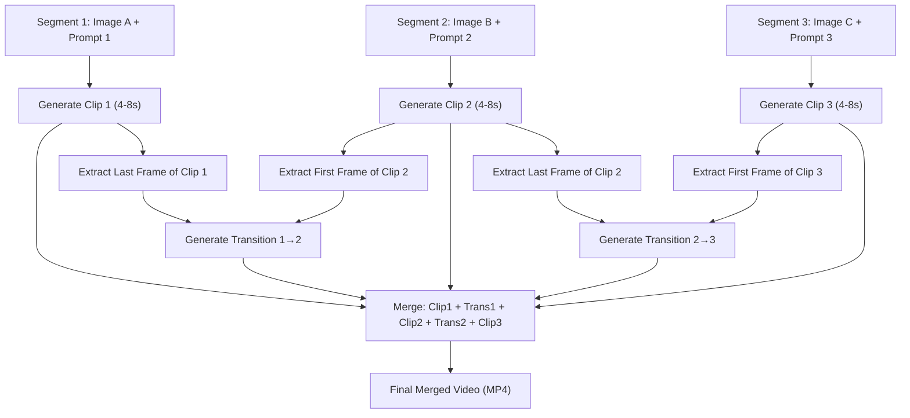

# Video Director Mode

Director Mode extends NeuroLink's [video generation](./video-generation.md) capability to produce **multi-segment videos with seamless AI-generated transitions**. Instead of a single clip, you define an array of **segments** — each with its own prompt and image — and NeuroLink orchestrates the full pipeline: generating each clip, extracting boundary frames, producing transition videos (with individually configurable durations) using Veo 3.1's first-and-last-frame interpolation, and merging everything into one continuous video.

## Overview

Director Mode is triggered automatically when you supply an **`input.segments`** array to the video generation API. Each segment is a self-documenting `{ prompt, image }` object, mapping cleanly to the pipeline concept of ordered video segments.



### How It Works

1. **Parallel clip generation** – All main clips are generated concurrently (fixed concurrency of 2) via Veo 3.1's image-to-video endpoint, with a circuit breaker that trips after 2 consecutive failures to avoid wasted API calls
2. **Frame extraction** – The last frame of clip N and first frame of clip N+1 are extracted from generated video buffers (with MP4 ftyp header validation)
3. **Parallel transition generation** – Veo 3.1 Fast's **first-and-last-frame interpolation** API generates transitions between each pair of adjacent clips in parallel (same concurrency limit), with individually configurable duration (4, 6, or 8 seconds each)
4. **Sequential merge** – Clips and transitions are concatenated: `Clip₁ → Trans₁₋₂ → Clip₂ → Trans₂₋₃ → Clip₃ → …`
5. **Single output** – The merged result is returned as one `VideoGenerationResult` buffer

### Key Technology: Veo First-and-Last-Frame Interpolation

The transition clips use Veo 3.1's native `lastFrame` parameter in the `predictLongRunning` API. Instead of generating from a single image, you provide **two** images — the first frame and the last frame — and Veo generates a video that smoothly interpolates between them:

```json
{
  "instances": [
    {
      "prompt": "Smooth cinematic transition",
      "image": {
        "bytesBase64Encoded": "<LAST_FRAME_OF_CLIP_N>",
        "mimeType": "image/jpeg"
      },
      "lastFrame": {
        "bytesBase64Encoded": "<FIRST_FRAME_OF_CLIP_N+1>",
        "mimeType": "image/jpeg"
      }
    }
  ],
  "parameters": {
    "sampleCount": 1,
    "durationSeconds": 6,
    "aspectRatio": "16:9",
    "resolution": "720p"
  }
}
```

This produces a physically coherent, AI-generated morph — far superior to simple crossfade or dissolve effects. The `durationSeconds` value is set independently for each transition (from the `transitionDurations` array), allowing shorter or longer interpolations per segment boundary.

## What You Get

- **Multi-segment video** – Chain any number of video segments into a single continuous output
- **AI transitions** – Per-transition configurable duration (4, 6, or 8 seconds each) generated by Veo 3.1 frame interpolation (not simple crossfades)
- **Parallel generation** – Both main clips and transitions are generated concurrently (fixed concurrency of 2) with a circuit breaker for clip failures
- **Mixed image inputs** – Each segment's `image` field accepts a Buffer, file path, URL, or `ImageWithAltText`
- **Consistent settings** – Resolution, aspect ratio, and audio settings apply uniformly across all segments and transitions
- **Per-segment customization** – Each segment is a self-contained `{ prompt, image }` object
- **Buffer validation** – All video buffers are validated for MP4 ftyp headers before frame extraction and merging
- **SDK only** – Use programmatically via `generate()` (CLI not supported for Director Mode)

## Supported Provider & Model

| Provider | Model                                            | Interpolation Support | Transition Duration | Max Segments | Concurrency |
| -------- | ------------------------------------------------ | --------------------- | ------------------- | ------------ | ----------- |
| `vertex` | `veo-3.1` (clips) / `veo-3.1-fast` (transitions) | First + Last Frame    | 4-8s per transition | 10           | 2 (fixed)   |

> **Note:** The `lastFrame` parameter is supported by `veo-2.0-generate-001`, `veo-3.1-generate-001`, and `veo-3.1-fast-generate-001`. NeuroLink uses `veo-3.1-generate-001` for main clips and `veo-3.1-fast-generate-001` for transition clips (faster generation with minimal quality difference for short interpolations).

## Prerequisites

Same as [Video Generation prerequisites](./video-generation.md#prerequisites), plus:

1. **Sufficient quota** – Director Mode generates `N + (N-1)` video operations (N clips + N-1 transitions). Ensure your Vertex AI project has adequate quota.
2. **Adequate timeout** – Multi-segment generation takes proportionally longer. Set `timeout` accordingly (recommended: 5-10 minutes for 3+ segments).

## Quick Start

### SDK Usage

```typescript
import { NeuroLink } from "@juspay/neurolink";
import { readFile, writeFile } from "fs/promises";

const neurolink = new NeuroLink();

// Director Mode: define segments → merged video
const result = await neurolink.generate({
  input: {
    segments: [
      {
        prompt: "Camera slowly pans across the product on a white table",
        image: await readFile("./scene1.jpg"),
      },
      {
        prompt: "Dynamic zoom into product details with dramatic lighting",
        image: await readFile("./scene2-detail.jpg"),
      },
      {
        prompt: "Wide shot pulling back to reveal the full scene",
        image: await readFile("./scene3-wide.jpg"),
      },
    ],
  },
  provider: "vertex",
  model: "veo-3.1",
  output: {
    mode: "video",
    video: {
      resolution: "720p",
      length: 6, // Per-segment clip duration (reused from VideoOutputOptions)
      aspectRatio: "16:9",
      audio: true,
    },
  },
  timeout: 600000, // 10 minutes for multi-segment
});

if (result.video) {
  await writeFile("director-output.mp4", result.video.data);
  console.log(`Total duration: ${result.video.metadata?.duration}s`);
  console.log(`Segments: ${result.video.metadata?.segmentCount}`);
}
```

### Using Image URLs

```typescript
import { NeuroLink } from "@juspay/neurolink";
import { writeFile } from "fs/promises";

const neurolink = new NeuroLink();

const result = await neurolink.generate({
  input: {
    segments: [
      {
        prompt: "Serene sunrise over calm waters",
        image: "https://example.com/sunrise.jpg",
      },
      {
        prompt: "Waves crashing on a rocky coastline",
        image: "https://example.com/coastline.jpg",
      },
    ],
  },
  provider: "vertex",
  model: "veo-3.1",
  output: {
    mode: "video",
    video: { resolution: "1080p", length: 8 },
  },
  timeout: 600000,
});

if (result.video) {
  await writeFile("ocean-director.mp4", result.video.data);
}
```

### Mixed Input Types

Each segment's `image` field accepts a Buffer, file path, URL, or `ImageWithAltText`:

```typescript
const result = await neurolink.generate({
  input: {
    segments: [
      {
        prompt: "Product reveal from shadow to light",
        image: await readFile("./product-dark.jpg"), // Buffer
      },
      {
        prompt: "360-degree rotation showcasing all angles",
        image: "https://cdn.example.com/product-turntable.png", // URL
      },
      {
        prompt: "Final hero shot with brand overlay",
        image: { data: await readFile("./hero.jpg"), altText: "Hero" }, // ImageWithAltText
      },
    ],
  },
  provider: "vertex",
  model: "veo-3.1",
  output: {
    mode: "video",
    video: { resolution: "1080p", length: 6, aspectRatio: "16:9" },
  },
});
```

> **Note:** Director Mode is SDK-only. CLI support is not available for this generation type. Use the standard `--outputMode video` CLI flags for single-clip video generation.

## Comprehensive Examples

### Example 1: Product Commercial (3 Segments)

```typescript
import { NeuroLink } from "@juspay/neurolink";
import { readFile, writeFile } from "fs/promises";

const neurolink = new NeuroLink();

const result = await neurolink.generate({
  input: {
    segments: [
      {
        prompt:
          "Dramatic reveal: camera sweeps up from a dark surface to unveil the product under a spotlight",
        image: await readFile("./product-dark.jpg"),
      },
      {
        prompt:
          "Close-up detail shot: camera slowly orbits the product, focusing on texture and craftsmanship",
        image: await readFile("./product-detail.jpg"),
      },
      {
        prompt:
          "Lifestyle context: camera pulls back to show the product in an elegant room setting",
        image: await readFile("./product-lifestyle.jpg"),
      },
    ],
  },
  provider: "vertex",
  model: "veo-3.1",
  output: {
    mode: "video",
    video: {
      resolution: "1080p",
      length: 8,
      aspectRatio: "16:9",
      audio: true,
    },
    // Director-specific options
    director: {
      transitionPrompts: [
        "Elegant dissolve with subtle camera drift",
        "Smooth pull-back revealing the wider scene",
      ],
      transitionDurations: [4, 6], // Per-transition: first transition 4s, second 6s
    },
  },
  timeout: 600000,
});

if (result.video) {
  await writeFile("product-commercial.mp4", result.video.data);

  console.log("Director Mode output:", {
    totalDuration: result.video.metadata?.duration, // ~34s (3×8s + 4s + 6s)
    segmentCount: result.video.metadata?.segmentCount, // 3
    transitionCount: result.video.metadata?.transitionCount, // 2
    resolution: result.video.metadata?.dimensions,
    fileSize: `${(result.video.data.length / 1024 / 1024).toFixed(1)} MB`,
  });
}
```

### Example 2: Social Media Story (Portrait, 4 Segments)

```typescript
import { NeuroLink } from "@juspay/neurolink";
import { readFile, writeFile } from "fs/promises";

const neurolink = new NeuroLink();

const result = await neurolink.generate({
  input: {
    segments: [
      {
        prompt: "Morning coffee being poured in slow motion",
        image: await readFile("./coffee.jpg"),
      },
      {
        prompt: "Hands wrapping a gift box with a ribbon",
        image: await readFile("./wrapping.jpg"),
      },
      {
        prompt: "Gift box placed on a doorstep, camera tilts up",
        image: await readFile("./doorstep.jpg"),
      },
      {
        prompt: "Recipient opens door, reaction shot",
        image: await readFile("./reaction.jpg"),
      },
    ],
  },
  provider: "vertex",
  model: "veo-3.1",
  output: {
    mode: "video",
    video: {
      resolution: "1080p",
      length: 4,
      aspectRatio: "9:16", // Portrait for stories/reels
      audio: true,
    },
    director: {
      transitionPrompts: [
        "Quick, energetic swipe transition",
        "Fast zoom through a blur into the next scene",
        "Snap cut with motion blur connecting the moments",
      ],
      transitionDurations: [4, 6, 8], // Each transition can have its own duration
    },
  },
  timeout: 900000,
});

if (result.video) {
  await writeFile("story.mp4", result.video.data);
  // Total: 4×4s clips + transitions (4s + 6s + 8s) = 34 seconds
}
```

### Example 3: AI-Driven Storyboard

```typescript
import { NeuroLink } from "@juspay/neurolink";
import { readFile, writeFile } from "fs/promises";

const neurolink = new NeuroLink();

// Step 1: Use AI to generate a storyboard from a concept
const storyboard = await neurolink.generate({
  input: {
    text: `Create a 3-scene storyboard for a 30-second product commercial for a luxury watch.
           Return a JSON array of objects with "scene" (number), "prompt" (video generation prompt),
           and "imageDescription" (what the input image should show).`,
  },
  provider: "vertex",
  model: "gemini-3-flash-preview",
  output: { format: "json" },
});

const scenes = JSON.parse(storyboard.content);

// Step 2: Generate video using the AI storyboard
const watchImages = [
  await readFile("./watch-closeup.jpg"),
  await readFile("./watch-wrist.jpg"),
  await readFile("./watch-lifestyle.jpg"),
];

const result = await neurolink.generate({
  input: {
    segments: scenes.map((s: { prompt: string }, i: number) => ({
      prompt: s.prompt,
      image: watchImages[i],
    })),
  },
  provider: "vertex",
  model: "veo-3.1",
  output: {
    mode: "video",
    video: { resolution: "1080p", length: 8, aspectRatio: "16:9" },
    director: {
      transitionPrompts: [
        "Cinematic slow dissolve with depth of field shift",
        "Smooth pan transitioning to the next scene",
      ],
    },
  },
  timeout: 600000,
});

if (result.video) {
  await writeFile("ai-storyboard.mp4", result.video.data);
}
```

### Example 4: Batch Director Mode

```typescript
import { NeuroLink } from "@juspay/neurolink";
import { readFile, writeFile, readdir } from "fs/promises";
import path from "path";

type StoryConfig = {
  name: string;
  segments: Array<{ prompt: string; imagePath: string }>;
};

async function batchDirectorGenerate(stories: StoryConfig[]) {
  const neurolink = new NeuroLink();
  const results = [];

  for (const story of stories) {
    console.log(`Generating: ${story.name}`);

    try {
      const segments = await Promise.all(
        story.segments.map(async (seg) => ({
          prompt: seg.prompt,
          image: await readFile(seg.imagePath),
        })),
      );

      const result = await neurolink.generate({
        input: {
          segments,
        },
        provider: "vertex",
        model: "veo-3.1",
        output: {
          mode: "video",
          video: { resolution: "720p", length: 6 },
        },
        timeout: 600000,
      });

      if (result.video) {
        const outputPath = `./output/${story.name}.mp4`;
        await writeFile(outputPath, result.video.data);
        results.push({ name: story.name, output: outputPath, success: true });
      }
    } catch (error) {
      results.push({
        name: story.name,
        success: false,
        error: error instanceof Error ? error.message : String(error),
      });
    }
  }

  return results;
}

// Usage
const results = await batchDirectorGenerate([
  {
    name: "product-A",
    segments: [
      { prompt: "Hero reveal", imagePath: "./a-hero.jpg" },
      { prompt: "Feature showcase", imagePath: "./a-feature.jpg" },
      { prompt: "Call to action", imagePath: "./a-cta.jpg" },
    ],
  },
  {
    name: "product-B",
    segments: [
      { prompt: "Unboxing experience", imagePath: "./b-unbox.jpg" },
      { prompt: "In-use demonstration", imagePath: "./b-demo.jpg" },
    ],
  },
]);

console.table(results);
```

### Example 5: Error Handling in Director Mode

> **⚠️ Full-job retry warning:** The `generateWithRetry` function below retries the _entire_ `neurolink.generate()` call on any retriable `VideoError`. This means **all segments and transitions are re-generated from scratch**, incurring full cost each attempt ($10-60+ depending on settings). This is appropriate only for transient failures (e.g., rate limits) where partial results are not recoverable.
>
> Note that Director Mode already handles transition failures gracefully — failed transitions fall back to hard cuts rather than failing the pipeline (see [Partial Failure Handling](#partial-failure-handling)). Only fatal errors like `DIRECTOR_CLIP_FAILED` or `DIRECTOR_MERGE_FAILED` propagate as `VideoError`. Keep this in mind when deciding whether a full-job retry is warranted.
>
> **Preferred approach:** Once per-segment resume semantics are available, prefer retrying at the clip/transition level rather than re-running the entire pipeline. Until then, if you use full-job retry, keep `maxRetries` low (1-2) and restrict retries to rate-limit or timeout errors to control costs.

```typescript
import { NeuroLink, VideoError } from "@juspay/neurolink";
import { readFile, writeFile } from "fs/promises";

const neurolink = new NeuroLink();

// WARNING: Each retry re-runs ALL segments via neurolink.generate(),
// incurring full API cost. See note above.
async function generateWithRetry(maxRetries = 2) {
  for (let attempt = 1; attempt <= maxRetries; attempt++) {
    try {
      const result = await neurolink.generate({
        input: {
          segments: [
            {
              prompt: "Product introduction",
              image: await readFile("./intro.jpg"),
            },
            {
              prompt: "Feature highlight",
              image: await readFile("./feature.jpg"),
            },
            {
              prompt: "Brand closing",
              image: await readFile("./closing.jpg"),
            },
          ],
        },
        provider: "vertex",
        model: "veo-3.1",
        output: {
          mode: "video",
          video: { resolution: "720p", length: 6 },
        },
        timeout: 600000,
      });

      if (result.video) {
        await writeFile("output.mp4", result.video.data);
        return result;
      }

      throw new Error("No video in result");
    } catch (error) {
      if (error instanceof VideoError) {
        console.error(
          `Attempt ${attempt} failed [${error.code}]:`,
          error.message,
        );

        // Don't retry configuration or validation errors
        if (
          error.category === "configuration" ||
          error.category === "validation" ||
          error.category === "permission"
        ) {
          throw error;
        }

        // Retry on rate limits and transient failures only.
        // Be aware: this re-runs the full Director pipeline (all segments + transitions).
        if (error.retriable && attempt < maxRetries) {
          const backoff = Math.pow(2, attempt) * 5000;
          console.log(
            `Retrying entire Director pipeline in ${backoff / 1000}s (attempt ${attempt + 1}/${maxRetries})...`,
          );
          await new Promise((r) => setTimeout(r, backoff));
          continue;
        }
      }

      throw error;
    }
  }
}
```

## Type Definitions

### Director Mode Input (Extended `GenerateOptions`)

Director Mode introduces a `DirectorSegment` type and adds a `segments` field to `GenerateOptions.input`:

```typescript
/**
 * A single segment in Director Mode, representing one video clip.
 */
type DirectorSegment = {
  /** Prompt describing the video content for this segment */
  prompt: string;
  /** Input image for this segment (Buffer, URL string, file path, or ImageWithAltText) */
  image: Buffer | string | ImageWithAltText;
};

type GenerateOptions = {
  input: {
    /** Prompt for standard (single-clip) mode */
    text: string;

    /** Standard mode images */
    images?: Array<Buffer | string | ImageWithAltText>;

    /**
     * Director Mode segments. When provided, Director Mode is activated automatically.
     * Each segment contains its own prompt and image — no need for separate text/images arrays.
     * Must contain 2-10 segments.
     */
    segments?: DirectorSegment[];

    // ... other existing fields
  };

  output?: {
    mode?: "text" | "video" | "ppt";

    /**
     * Video output options. In Director Mode, `video.length` controls the
     * per-segment clip duration (4, 6, or 8 seconds). There is no separate
     * `segmentDurationSeconds` field — this single field applies uniformly
     * to all segments to avoid duplication and ambiguity.
     */
    video?: VideoOutputOptions;

    /** Director Mode configuration (only used when input.segments is provided) */
    director?: DirectorModeOptions;
  };

  // ... other existing fields
};
```

### DirectorModeOptions

```typescript
type DirectorModeOptions = {
  /**
   * Prompts for generating transition clips (array of N-1 entries for N segments).
   * transitionPrompts[i] is used for the transition between segment i and segment i+1.
   * If provided, must contain exactly N-1 prompts where N is the number of segments.
   *
   * **When omitted:** The pipeline auto-generates a default prompt for each transition:
   * `"Smooth cinematic transition between scenes"`. This produces a generic but
   * visually coherent interpolation. For narrative-driven videos, explicit prompts
   * that describe the desired camera movement or visual flow are recommended.
   */
  transitionPrompts?: string[];

  /**
   * Duration of each transition clip in seconds (array of N-1 entries for N segments).
   * transitionDurations[i] sets the duration for the transition between segment i and segment i+1.
   * Each value must be 4, 6, or 8 (4 recommended for seamless feel).
   * If omitted, all transitions default to 4 seconds.
   * @default [4, 4, ...] (all 4s)
   */
  transitionDurations?: Array<4 | 6 | 8>;
};
```

> **Note:** Concurrency is fixed internally at 2 parallel Vertex API calls. This is not user-configurable — it balances throughput against API rate limits and is shared across both clip generation and transition generation phases.

### Extended VideoGenerationResult (Director Mode)

```typescript
type VideoGenerationResult = {
  data: Buffer;
  mediaType: "video/mp4" | "video/webm";
  metadata?: {
    // Standard fields
    duration?: number;
    dimensions?: { width: number; height: number };
    model?: string;
    provider?: string;
    aspectRatio?: string;
    audioEnabled?: boolean;
    processingTime?: number;

    // Director Mode fields (present when Director Mode is used)
    /** Number of main segments in the video */
    segmentCount?: number;
    /** Number of transition clips generated */
    transitionCount?: number;
    /** Duration of each main clip in seconds */
    clipDuration?: number;
    /** Durations of each transition in seconds (one per transition) */
    transitionDurations?: number[];
    /** Per-segment metadata */
    segments?: Array<{
      index: number;
      duration: number;
      processingTime: number;
    }>;
    /** Per-transition metadata */
    transitions?: Array<{
      fromSegment: number;
      toSegment: number;
      duration: number;
      processingTime: number;
    }>;
  };
};
```

## Architecture & Implementation

### Pipeline Flow

```
User Input (N segments, each with prompt + image)
    │
    ▼
┌─────────────────────────────────┐
│  1. Validation                  │
│  - Validate each segment has    │
│    prompt and image             │
│  - Enforce segment limit (≤10)  │
└─────────────────┬───────────────┘
                  │
                  ▼
┌─────────────────────────────────┐
│  2. Parallel Clip Generation    │
│  - Generate N clips via         │
│    generateVideoWithVertex()    │
│  - Respect concurrency limit    │
└─────────────────┬───────────────┘
                  │
                  ▼
┌─────────────────────────────────┐
│  3. Frame Extraction            │
│  - Extract last frame from      │
│    clip[i] (decode MP4 → JPEG)  │
│  - Extract first frame from     │
│    clip[i+1]                    │
└─────────────────┬───────────────┘
                  │
                  ▼
┌─────────────────────────────────┐
│  4. Parallel Transition Gen.    │
│  - For each pair (i, i+1):      │
│    Call Veo with image (last    │
│    frame) + lastFrame (first    │
│    frame of next clip)          │
│  - Per-transition duration      │
│  - Parallel (concurrency = 2)   │
│  - Failures → hard cut fallback │
└─────────────────┬───────────────┘
                  │
                  ▼
┌─────────────────────────────────┐
│  5. Video Merge                 │
│  - Concatenate:                 │
│    clip1 + trans1 + clip2 +     │
│    trans2 + ... + clipN         │
│  - Re-mux to single MP4         │
└─────────────────┬───────────────┘
                  │
                  ▼
         VideoGenerationResult
         (merged buffer + metadata)
```

### Dependency DAG

The pipeline has a **per-pair dependency structure** — each transition depends only on its two adjacent clips, not on all clips globally. Understanding this DAG is essential for maximizing parallelism without race conditions:

```
Phase 1 – Clip Generation (parallel, subject to concurrency limit):

    Clip₁         Clip₂         Clip₃        ...  ClipN
      │             │             │                  │
      ▼             ▼             ▼                  ▼

Phase 2 – Frame Extraction (per-clip, runs as soon as a clip completes):

  lastFrame₁   firstFrame₂   lastFrame₂   firstFrame₃  ...  firstFrameN
      │             │             │             │                 │
      └──────┬──────┘             └──────┬──────┘                │
             ▼                           ▼                       │

Phase 3 – Parallel Transition Generation (per-pair, each depends on its two boundary frames):

  (once Clip₁ & Clip₂ done)  (once Clip₂ & Clip₃ done)
        Trans₁₋₂                   Trans₂₋₃           ...   Trans₍N₋₁₎₋N
             │                           │                       │
             └───────────┬───────────────┘───────────────────────┘
                         ▼

Phase 4 – Sequential Merge (must wait for ALL clips and transitions):

    Clip₁ → Trans₁₋₂ → Clip₂ → Trans₂₋₃ → Clip₃ → ... → ClipN
                              │
                              ▼
                     Final Merged Video
```

**Key constraint:** Each transition Trans₍ᵢ₎₋₍ᵢ₊₁₎ depends only on Clip₍ᵢ₎ and Clip₍ᵢ₊₁₎ — specifically, the last frame of Clip₍ᵢ₎ and the first frame of Clip₍ᵢ₊₁₎. Frame extraction runs per-clip as soon as each Clip₍ᵢ₎ finishes (not after all clips complete). Transition generation then runs in parallel (concurrency = 2, shared with the clip phase) as soon as the required adjacent clip pair is ready. Each transition that fails degrades to a hard cut rather than failing the pipeline. Phase 4 (merge) remains strictly sequential and must wait for all clips and transitions to complete before concatenation.

**Circuit breaker:** During clip generation, if 2 consecutive clips fail, the circuit breaker trips and remaining clips are skipped immediately. This avoids wasting API quota on a provider that is likely experiencing an outage.

### Technology Dependencies

#### FFmpeg Adapter (`ffmpegAdapter.ts`)

All video operations (frame extraction and merging) use a **shared FFmpeg adapter** (`ffmpegAdapter.ts`) that centralizes:

- **Binary resolution:** FFmpeg path is resolved once and cached. Resolution order:
  1. `FFMPEG_PATH` environment variable (explicit path)
  2. `ffmpeg-static` npm package (optional peer dependency)
  3. System `ffmpeg` on PATH
- **Temp directory management:** Creates tracked temp directories with process-level cleanup handlers (`process.on("exit")`) to prevent orphaned files on abnormal exit.
- **Buffer validation:** `isValidMp4Buffer()` checks minimum size (12 bytes) and MP4 ftyp box magic bytes at offset 4-7 before any FFmpeg processing.
- **Named constants:** All timeouts, buffer sizes, and quality parameters are exported constants (`FFMPEG_FRAME_TIMEOUT_MS=30s`, `FFMPEG_MERGE_TIMEOUT_MS=120s`, `JPEG_QUALITY="2"`, etc.).

#### Frame Extraction (`frameExtractor.ts`)

Frame extraction uses the native FFmpeg binary via the shared adapter:

- **Operation:** Writes video buffer to a temp file → runs FFmpeg to seek and extract → reads JPEG output → cleans up temp files.
- **Validation:** Each input buffer is validated with `isValidMp4Buffer()` before processing. Invalid buffers throw `VideoError` with `DIRECTOR_FRAME_EXTRACTION_FAILED` code.
- **Performance:** First/last frame extraction from a 4-8s clip completes in <100ms.

#### Video Merging (`videoMerger.ts`)

Video concatenation uses the native FFmpeg binary via the shared adapter:

- **Method:** FFmpeg concat demuxer for lossless MP4 concatenation (no re-encoding when codecs match).
- **Operation:** Writes clip buffers to temp files → builds concat list → runs `ffmpeg -f concat -safe 0 -i list.txt -c copy output.mp4`.
- **Re-encoding fallback:** If clips have mismatched codecs (unlikely since all come from Veo), falls back to re-encoding with H.264 (`libx264`, CRF 18, `fast` preset).
- **Validation:** Each input buffer is validated with `isValidMp4Buffer()` before processing. A single buffer is returned as-is without merging.
- **Cleanup:** All temp files and directories are cleaned up in `finally` blocks, with failures logged at debug level.

> **Dependency:** A native `ffmpeg` binary is required. Install via your OS package manager, Docker layer, Lambda layer, or the optional `ffmpeg-static` npm package. Set `FFMPEG_PATH` to explicitly specify the binary location.

````

### Transition Generation: Veo API Request

Each transition clip uses the **first-and-last-frame** Veo endpoint. The request body includes both `image` (first frame = last frame of previous clip) and `lastFrame` (last frame = first frame of next clip):

```typescript
const transitionRequestBody = {
  instances: [
    {
      prompt: transitionPrompts[i], // i-th transition prompt (0-indexed)
      image: {
        bytesBase64Encoded: lastFrameOfClipN, // Last frame of preceding clip
        mimeType: "image/jpeg",
      },
      lastFrame: {
        bytesBase64Encoded: firstFrameOfClipN1, // First frame of following clip
        mimeType: "image/jpeg",
      },
    },
  ],
  parameters: {
    sampleCount: 1,
    durationSeconds: transitionDurations[i], // Per-transition duration (4, 6, or 8)
    aspectRatio: "16:9", // Matches main clips
    resolution: "720p", // Matches main clips
    generateAudio: true, // Matches main clips
  },
};
````

This uses the same `predictLongRunning` → `fetchPredictOperation` polling flow as standard video generation, with the addition of the `lastFrame` field.

### Implementation Files

| File                                           | Purpose                                                                                                |
| ---------------------------------------------- | ------------------------------------------------------------------------------------------------------ |
| `src/lib/adapters/video/vertexVideoHandler.ts` | Extended with `generateTransitionWithVertex()`, `lastFrame` support, `VideoError`, `VIDEO_ERROR_CODES` |
| `src/lib/adapters/video/directorPipeline.ts`   | Director Mode orchestrator: parallel clip generation (circuit breaker), parallel transitions, merge    |
| `src/lib/adapters/video/ffmpegAdapter.ts`      | Shared FFmpeg adapter: binary resolution, temp file management, process execution, buffer validation   |
| `src/lib/adapters/video/frameExtractor.ts`     | Extract first/last frames from MP4 buffers via native FFmpeg binary                                    |
| `src/lib/adapters/video/videoMerger.ts`        | Concatenate video buffers into single MP4 via FFmpeg concat demuxer (lossless when codecs match)       |
| `src/lib/types/multimodal.ts`                  | `DirectorSegment`, `DirectorModeOptions` type definitions                                              |
| `src/lib/types/generateTypes.ts`               | Extended `GenerateOptions` input with `segments` field                                                 |
| `src/lib/core/baseProvider.ts`                 | Director Mode detection and routing in `handleVideoGeneration()`                                       |
| `src/lib/utils/parameterValidation.ts`         | `validateDirectorModeInput()` validation                                                               |

### Key Functions

- **`generateTransitionWithVertex(firstFrame, lastFrame, prompt, options, duration, region)`** – Generates a transition clip using Veo 3.1 Fast's first-and-last-frame API
- **`extractFirstFrame(videoBuffer)`** – Extracts the first frame from a video buffer as JPEG (validates MP4 ftyp header)
- **`extractLastFrame(videoBuffer)`** – Extracts the last frame from a video buffer as JPEG (validates MP4 ftyp header)
- **`mergeVideoBuffers(buffers)`** – Concatenates multiple MP4 buffers into one (validates each buffer)
- **`executeDirectorPipeline(segments, videoOptions, directorOptions, region)`** – Full Director Mode orchestrator
- **`validateDirectorModeInput(options)`** – Validates segment structure, count, transition prompts/durations
- **`isValidMp4Buffer(buffer)`** – Validates MP4 buffer has ftyp header (from `ffmpegAdapter.ts`)
- **`getFfmpegPath()`** – Resolves FFmpeg binary path with caching (from `ffmpegAdapter.ts`)

## Configuration & Best Practices

### Duration Calculation

> **Note:** In Director Mode, `output.video.length` controls the duration of each main segment clip. There is no separate `segmentDurationSeconds` field — the existing `VideoOutputOptions.length` is reused to avoid duplication. All segments share the same clip duration; per-segment duration variance is not currently supported (use different Director Mode calls if needed).

Each transition can have its own duration, so the total is the sum of all clip durations plus the sum of all individual transition durations:

| Segments | Clip Duration | Transition Durations | Total Duration            |
| -------- | ------------- | -------------------- | ------------------------- |
| 2        | 6s            | [4s]                 | 16s (2×6 + 4)             |
| 3        | 8s            | [4s, 6s]             | 34s (3×8 + 4 + 6)         |
| 4        | 4s            | [4s, 6s, 8s]         | 34s (4×4 + 4 + 6 + 8)     |
| 5        | 6s            | [4s, 6s, 4s, 8s]     | 52s (5×6 + 4 + 6 + 4 + 8) |
| N        | Ds            | [T₁, T₂, …, T₍ₙ₋₁₎]  | N×D + Σ Tᵢ                |

### API Call Count

| Segments | Main Clips | Transition Clips | Total API Calls |
| -------- | ---------- | ---------------- | --------------- |
| 2        | 2          | 1                | 3               |
| 3        | 3          | 2                | 5               |
| 5        | 5          | 4                | 9               |
| 10       | 10         | 9                | 19              |

### Worst-Case Analysis (10 Segments at Maximum Settings)

The 10-segment limit balances capability with practical constraints:

| Metric                   | Value        | Calculation                                                |
| ------------------------ | ------------ | ---------------------------------------------------------- |
| **Total API calls**      | 19           | 10 clips + 9 transitions                                   |
| **Wall-clock time**      | ~25 minutes  | ceil(10/2) × 3min (clips) + ceil(9/2) × 2min (transitions) |
| **Total video duration** | ~152 seconds | 10 × 8s (clips) + 9 × 8s (transitions, worst case)         |
| **Burst quota required** | 2 concurrent | Fixed concurrency of 2                                     |

> **Why 10?** Beyond 10 segments, single-pipeline wall-clock time exceeds 30 minutes and costs grow proportionally. For longer productions, chain multiple Director Mode calls and concatenate the outputs externally, or use the upcoming Batch Director API.

### Best Practices

#### 1. Prompt Engineering for Transitions

```typescript
// ❌ Generic / unhelpful
const badTransition = "Make a transition";

// ✅ Describe the camera movement or visual flow
const goodTransition =
  "Camera smoothly drifts right, transitioning between scenes";

// ✅ Match the scene context
const contextualTransition =
  "Focus shifts from foreground to background as light changes";

// ✅ Use per-transition prompts for narrative coherence
const perTransition = [
  "Camera follows a path from the garden into the house",
  "Time-lapse of light changing from day to dusk",
];
```

#### 2. Image Preparation for Smooth Transitions

```typescript
// Best results when adjacent segments share visual characteristics:
// - Similar color palette
// - Compatible lighting conditions
// - Related subject matter

// The Veo interpolation works best when:
// 1. Both frames have similar aspect ratios to the target
// 2. The visual distance between frames is moderate (not extreme jumps)
// 3. Images are well-exposed and sharp
```

#### 3. Timeout Configuration

```typescript
// Rule of thumb: ~2-3 minutes per video generation call
// With fixed concurrency=2: timeout ≥ ceil(N/2) × 180000 + ceil((N-1)/2) × 180000

// 3 segments: ~10 minutes
const threeSegments = { timeout: 600000 };

// 5 segments: ~15 minutes
const fiveSegments = { timeout: 900000 };

// 10 segments: ~30 minutes
const tenSegments = { timeout: 1800000 };
```

#### 4. Cost Optimization

| Strategy                              | Impact            | Trade-off              |
| ------------------------------------- | ----------------- | ---------------------- |
| Use 720p for drafts                   | ~20% lower cost   | Lower visual quality   |
| Use 4s clips for previews             | ~50% lower cost   | Shorter segments       |
| Limit to 3-5 segments                 | Fewer API calls   | Shorter total video    |
| Use `veo-3.1-fast` for main clips too | Faster generation | Slightly lower quality |

> **Pricing reference:** Look up current per-second rates for Veo 3.1 (main clips) and Veo 3.1 Fast (transitions) on the [Vertex AI Generative AI pricing page](https://cloud.google.com/vertex-ai/generative-ai/pricing). Rates vary by resolution (720p vs 1080p) and model variant.

## Error Handling & Validation

### Director Mode Validation Rules

| Parameter                  | Validation                                                  | Error Message                                                                                         |
| -------------------------- | ----------------------------------------------------------- | ----------------------------------------------------------------------------------------------------- |
| `input.segments`           | Must be array with 2-10 entries                             | `Director Mode requires 2-10 segments`                                                                |
| `input.segments[i].prompt` | Must be a non-empty string                                  | `Segment X requires a non-empty prompt`                                                               |
| `input.segments[i].image`  | Must be Buffer, string (URL/path), or ImageWithAltText      | `Segment X requires a valid image (Buffer, URL, path, or ImageWithAltText)`                           |
| `transitionPrompts`        | Optional; if provided, length must be N-1                   | `Expected X transition prompts, got Y`                                                                |
| `transitionDurations`      | Optional; if provided, array of N-1 values, each 4, 6, or 8 | `Expected N-1 transition durations, got X` / `Invalid transition duration at index X. Use 4, 6, or 8` |
| Segment limit              | Max 10 segments                                             | `Director Mode supports up to 10 segments`                                                            |

### Partial Failure Handling

Director Mode uses a **differentiated failure strategy** depending on which pipeline stage fails:

| Failure Type                    | Behavior                                                                                                                               | Rationale                                                                                                               |
| ------------------------------- | -------------------------------------------------------------------------------------------------------------------------------------- | ----------------------------------------------------------------------------------------------------------------------- |
| **Main clip generation fails**  | Pipeline fails immediately with `DIRECTOR_CLIP_FAILED` error. Returns metadata about which segments succeeded (for debugging).         | A missing segment cannot be meaningfully recovered — the final video would have a gap.                                  |
| **Frame extraction fails**      | Retry extraction once. If retry fails, skip the affected transition and fall back to a hard cut.                                       | Frame extraction is a local CPU operation; transient failures are rare but possible with corrupted buffers.             |
| **Transition generation fails** | Skip the failed transition and concatenate adjacent clips directly (hard cut). Log a warning.                                          | A missing transition degrades quality but produces a valid video. The user can re-run with a simpler transition prompt. |
| **Video merge fails**           | Pipeline fails with `DIRECTOR_MERGE_FAILED` error. Returns individual clip buffers in `error.context.clipBuffers` for manual recovery. | Merge failure is non-recoverable within the pipeline, but individual clips are still valuable.                          |

**Design rationale:** Main clip failures are fatal because there's no sensible way to fill a segment gap. Transition failures are non-fatal because a hard cut (direct concatenation) is a valid — if less polished — editing technique. This mirrors how professional video editors treat transitions as optional polish, not structural requirements.

**Partial result metadata:** When transitions fall back to hard cuts, the result metadata indicates which transitions were skipped:

```typescript
// If a transition clip fails, the pipeline can:
// 1. Skip the transition (hard cut between clips)
// 2. Retry the transition with a simpler prompt
// 3. Fail the entire operation (default for main clip failures)

const result = await neurolink.generate({
  input: {
    segments: [
      { prompt: "Scene 1", image: img1 },
      { prompt: "Scene 2", image: img2 },
      { prompt: "Scene 3", image: img3 },
    ],
  },
  provider: "vertex",
  model: "veo-3.1",
  output: {
    mode: "video",
    video: { resolution: "720p", length: 6 },
    director: {
      transitionPrompts: [
        "Smooth cinematic transition between scenes",
        "Gentle camera drift connecting the moments",
      ],
    },
  },
});

// If transition 1→2 fails but clips succeed, the result may contain
// a hard cut at that point. Check metadata for details:
if (result.video?.metadata?.transitions) {
  for (const tx of result.video.metadata.transitions) {
    if (!tx.duration) {
      console.warn(
        `Transition ${tx.fromSegment}→${tx.toSegment} used hard cut`,
      );
    }
  }
}
```

### Error Types

Director Mode error codes are part of the unified `VIDEO_ERROR_CODES` constant exported from `vertexVideoHandler.ts`. All Director Mode errors are thrown as `VideoError` (extends `NeuroLinkError`):

```typescript
// Director-specific codes within VIDEO_ERROR_CODES
const VIDEO_ERROR_CODES = {
  // Standard video error codes
  GENERATION_FAILED: "VIDEO_GENERATION_FAILED",
  PROVIDER_NOT_CONFIGURED: "VIDEO_PROVIDER_NOT_CONFIGURED",
  POLL_TIMEOUT: "VIDEO_POLL_TIMEOUT",
  INVALID_INPUT: "VIDEO_INVALID_INPUT",

  // Director Mode error codes
  /** Invalid segment structure (missing prompt or image) */
  DIRECTOR_SEGMENT_MISMATCH: "DIRECTOR_SEGMENT_MISMATCH",
  /** Too many segments requested */
  DIRECTOR_SEGMENT_LIMIT_EXCEEDED: "DIRECTOR_SEGMENT_LIMIT_EXCEEDED",
  /** A main clip generation call failed (fatal) */
  DIRECTOR_CLIP_FAILED: "DIRECTOR_CLIP_FAILED",
  /** Frame extraction from clip failed */
  DIRECTOR_FRAME_EXTRACTION_FAILED: "DIRECTOR_FRAME_EXTRACTION_FAILED",
  /** Transition clip generation failed (non-fatal, falls back to hard cut) */
  DIRECTOR_TRANSITION_FAILED: "DIRECTOR_TRANSITION_FAILED",
  /** Video merge/concatenation failed */
  DIRECTOR_MERGE_FAILED: "DIRECTOR_MERGE_FAILED",
  /** Pipeline timeout (overall) */
  DIRECTOR_PIPELINE_TIMEOUT: "DIRECTOR_PIPELINE_TIMEOUT",
} as const;
```

## Comparison: Standard vs Director Mode

| Feature         | Standard Video Generation     | Director Mode                                                |
| --------------- | ----------------------------- | ------------------------------------------------------------ |
| Input format    | `input.text` + `input.images` | `input.segments` array (2-10 `DirectorSegment` objects)      |
| Output          | Single clip (4-8s)            | Merged multi-segment video                                   |
| Transitions     | N/A                           | AI-generated clips with per-transition duration (4-8s)       |
| API calls       | 1                             | N + (N-1) calls                                              |
| Veo API feature | `image` only                  | `image` + `lastFrame`                                        |
| Processing time | 1-3 minutes                   | 5-30 minutes (depends on segment count)                      |
| Max duration    | 8 seconds                     | ~152s (10×8s clips + 9×8s transitions max)                   |
| Concurrency     | N/A                           | Fixed at 2 parallel operations (clips + transitions)         |
| Error recovery  | All-or-nothing                | Circuit breaker for clips, hard cut fallback for transitions |

## Troubleshooting

| Symptom                            | Cause                                       | Solution                                                   |
| ---------------------------------- | ------------------------------------------- | ---------------------------------------------------------- |
| "Segment mismatch" error           | Missing prompt or image in a segment        | Ensure each segment has both `prompt` and `image`          |
| Transition looks jarring           | Large visual gap between adjacent clips     | Use visually similar images; improve transition prompt     |
| Pipeline timeout                   | Too many segments or high resolution        | Reduce segment count, use 720p, or increase timeout        |
| Rate limit errors                  | Too many concurrent API calls               | Concurrency is fixed at 2; reduce segment count instead    |
| Frame extraction fails             | Corrupted video buffer                      | Retry the failed clip generation                           |
| Audio discontinuity at transitions | Each clip has independently generated audio | Expected behavior — transition clips bridge the audio gap  |
| "Segment limit exceeded"           | More than 10 segments provided              | Split into multiple Director Mode calls                    |
| High cost                          | Many high-resolution segments               | Use 720p and 4s clips for drafts, upgrade for final output |

### Debug Mode

```typescript
// Enable debug logging to trace the Director pipeline
const neurolink = new NeuroLink({
  debug: true,
  logLevel: "verbose",
});

// Or via environment variable
// export NEUROLINK_DEBUG=true

// Debug output shows:
// - Segment validation results
// - Per-clip generation start/completion
// - Frame extraction timing
// - Transition generation details
// - Merge operation status
```

## Limitations

| Limitation             | Description                                                | Workaround                                                    |
| ---------------------- | ---------------------------------------------------------- | ------------------------------------------------------------- |
| Max 10 segments        | API and processing constraints                             | Chain multiple Director Mode calls                            |
| Fixed transition model | Transitions always use `veo-3.1-fast`; not configurable    | N/A                                                           |
| No custom audio        | Audio is AI-generated for each clip independently          | Post-process with external audio editing tools                |
| Fixed concurrency      | Concurrency is hardcoded to 2; not user-configurable       | Adjust segment count to control API load                      |
| Requires native FFmpeg | FFmpeg binary must be available for frame extraction/merge | Install via package manager, Docker layer, or `ffmpeg-static` |
| MP4 output only        | Merged output is always MP4                                | Convert with ffmpeg post-generation if needed                 |
| Vertex AI only         | Veo models are Vertex-exclusive                            | No alternative providers currently                            |
| Processing time        | Multi-segment is inherently slower                         | Use lower resolution and shorter clips for drafts             |

## Related Features

- [Video Generation](./video-generation.md) – Single-clip video generation (Director Mode builds on this)
- [Multimodal Chat](./multimodal-chat.md) – Image and file input capabilities
- [Video Analysis](./video-analysis) – Analyze existing video content

**Next:** [Video Generation](./video-generation.md) | [Multimodal Chat](./multimodal-chat.md)
