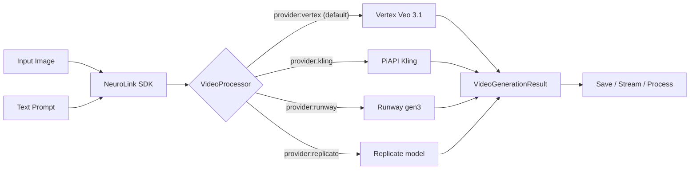

# Video Generation with Veo 3.1

NeuroLink integrates multiple video-generation providers — Google's Veo 3.1 (default), Kling, Runway, and Replicate-hosted models — behind a single `nl.generate({ output: { mode: "video" } })` call. Transform static images into dynamic, professional-quality video content with synchronized audio (where the provider supports it).

## Overview

Video generation in NeuroLink dispatches through the central `VideoProcessor` registry. The system uses the existing `generate()` function with video-specific options:

1. **Accepts** an input image via `input.images` and text prompt via `input.text`
2. **Validates** image format, size, and aspect ratio requirements
3. **Selects** the handler matching `output.video.provider` (default `"vertex"`) — see [Routing Across Providers](#routing-across-providers) below
4. **Generates** a clip (length / audio / resolution support varies per provider)
5. **Returns** a `VideoGenerationResult` containing video buffer and metadata



## What You Get

- **Video with audio** – Generate 8-second video clips with synchronized audio from a single image and text prompt
- **SDK integration** – Use existing `neurolink.generate()` with `output.mode: "video"` to create videos
- **CLI support** – Generate videos directly from the command line with `--outputMode video`
- **Buffer-based output** – Receive video as Buffer objects via `VideoGenerationResult` for flexible post-processing
- **Multiple resolutions** – Support for 720p and 1080p output
- **Aspect ratio control** – Choose between 9:16 (portrait) and 16:9 (landscape) formats
- **Director Mode** – Chain multiple segments into one continuous video with AI-generated transitions (see [Video Director Mode](./video-director-mode))

## Supported Providers & Models

`nl.generate({ output: { mode: "video", video: { provider } } })`
dispatches through the central `VideoProcessor` registry, which knows
four shipped handlers. The default when `provider` is omitted is
`vertex`.

### Provider Compatibility

| Provider    | Default Model                             | Length         | Audio          | Input                                | Auth                             | Notes                                                                                                                     |
| ----------- | ----------------------------------------- | -------------- | -------------- | ------------------------------------ | -------------------------------- | ------------------------------------------------------------------------------------------------------------------------- |
| `vertex`    | `veo-3.1`                                 | 4 / 6 / 8 s    | Yes            | image + text prompt                  | `GOOGLE_APPLICATION_CREDENTIALS` | Default — best fit for GCP / Vertex tenants                                                                               |
| `kling`     | PiAPI Kling v1.6                          | 5 / 10 s       | No             | publicly accessible image URL + text | `KLING_API_KEY` (PiAPI token)    | Requires `imageUrl` (handler rejects inline base64). See [provider guide](../getting-started/providers/kling.md).         |
| `runway`    | Runway gen3                               | 5 / 10 s       | No             | image + text                         | `RUNWAY_API_KEY`                 | Length must be 5 or 10 (rejected at upstream if 4). See [provider guide](../getting-started/providers/runway.md).         |
| `replicate` | `meta/wan-2-2/i2v` (override via `model`) | Model-specific | Model-specific | image + text                         | `REPLICATE_API_TOKEN`            | Any image-to-video model on Replicate via `video.model`. See [provider guide](../getting-started/providers/replicate.md). |

### Model Versions & Capabilities

| Model Version | Release Date | Key Features                  | Notes                           |
| ------------- | ------------ | ----------------------------- | ------------------------------- |
| `veo-3.1`     | 2024         | Audio generation, 8s duration | **Default for `vertex`**        |
| `kling-v1.6`  | 2024         | Sharp motion, 720p / 1080p    | Routed via PiAPI                |
| `gen3-turbo`  | 2024         | 5 s / 10 s clips, 720p+       | Runway's faster generation tier |

> **Note:** Use the per-provider setup pages
> ([Vertex Veo](../getting-started/providers/google-vertex.md),
> [Kling](../getting-started/providers/kling.md),
> [Runway](../getting-started/providers/runway.md),
> [Replicate](../getting-started/providers/replicate.md))
> for credential and quota details.

### Known Limitations

- `vertex`: max video duration 8 seconds per clip (4 / 6 / 8 s); image required; audio auto-generated; concurrent request limit 5 per project; processing 30–120 s
- `kling`: image must be a publicly accessible URL — pass `video.imageUrl`. Inline `Buffer` images are rejected at the handler
- `runway`: length validated upstream as 5 or 10 seconds — using `4` will surface a Runway 400. The local 4 / 6 / 8 schema gate matches Vertex's contract; future versions may widen the type
- `replicate`: per-model quirks (some models have token caps, some return WebP/GIF). Override `video.model` to pick a specific model checkpoint
- For multi-segment videos with transitions, see [Video Director Mode](./video-director-mode) (currently Vertex-only)

### Routing Across Providers

Pick a provider per-call by setting `output.video.provider`:

```typescript
// Vertex (default — same as omitting `provider`)
await nl.generate({
  input: { text: "...", images: [imageBuffer] },
  output: {
    mode: "video",
    video: { provider: "vertex", length: 6, resolution: "720p" },
  },
});

// Kling (PiAPI) — requires a publicly accessible image URL, not a Buffer
await nl.generate({
  input: { text: "...", images: [imageBuffer] },
  output: {
    mode: "video",
    video: {
      provider: "kling",
      imageUrl: "https://your-cdn.example.com/source.jpg",
      length: 5,
      resolution: "720p",
    },
  },
});

// Runway gen3 — length must be 5 or 10 upstream
await nl.generate({
  input: { text: "...", images: [imageBuffer] },
  output: {
    mode: "video",
    video: { provider: "runway", length: 5, resolution: "720p" },
  },
});

// Replicate (any image-to-video model)
await nl.generate({
  input: { text: "...", images: [imageBuffer] },
  output: {
    mode: "video",
    video: { provider: "replicate", model: "meta/wan-2-2/i2v", length: 4 },
  },
});
```

`result.provider` echoes the chosen handler — useful for logging and
multi-provider A/B harnesses.

#### Unknown Provider Behavior

Passing an unregistered provider name throws a typed
`VideoError(VIDEO_ERROR_CODES.PROVIDER_NOT_SUPPORTED)` with the list of
known names. NeuroLink does **not** silently fall back to Vertex when
the requested provider is unknown — a misspelled provider is always
surfaced as an error.

```typescript
try {
  await nl.generate({
    input: { text: "...", images: [imageBuffer] },
    output: { mode: "video", video: { provider: "klng" /* typo */ } },
  });
} catch (err) {
  // err.code === "VIDEO_PROVIDER_NOT_SUPPORTED"
  // err.context.available === ["vertex", "kling", "runway", "replicate"]
}
```

## Prerequisites

1. **Vertex AI credentials** with Veo access enabled
2. **Google Cloud project** with billing enabled
3. **Service account** with `aiplatform.user` role
4. **Sufficient storage** for video buffers (each 8-second video is approximately 2-5 MB)

## Quick Start

### SDK Usage

```typescript
import { NeuroLink } from "@juspay/neurolink";
import { readFileSync, writeFileSync } from "fs";

const neurolink = new NeuroLink();

// Basic video generation using generate() with video output mode
const result = await neurolink.generate({
  input: {
    text: "Camera slowly zooms in on the product with soft lighting",
    images: [readFileSync("./product-image.jpg")],
  },
  provider: "vertex",
  model: "veo-3.1",
  output: {
    mode: "video",
    video: {
      resolution: "720p",
      length: 8,
      aspectRatio: "16:9",
      audio: true,
    },
  },
});

// Access video data from VideoGenerationResult
if (result.video) {
  writeFileSync("output.mp4", result.video.data);
  console.log(`Video generated: ${result.video.metadata?.duration}s`);
}
```

#### With Full Options

```typescript
import { NeuroLink } from "@juspay/neurolink";
import { readFile, writeFile } from "fs/promises";

const neurolink = new NeuroLink();

const result = await neurolink.generate({
  input: {
    text: "Dynamic camera movement showcasing the product from multiple angles",
    images: [await readFile("./input.jpg")],
  },
  provider: "vertex",
  model: "veo-3.1",
  output: {
    mode: "video",
    video: {
      resolution: "1080p",
      length: 8,
      aspectRatio: "16:9",
      audio: true,
    },
  },
});

if (result.video) {
  await writeFile("output.mp4", result.video.data);

  console.log("Video metadata:", {
    duration: result.video.metadata?.duration,
    dimensions: result.video.metadata?.dimensions,
    format: result.video.mediaType,
  });
}
```

#### Image URL Input

```typescript
import { NeuroLink } from "@juspay/neurolink";
import { writeFile } from "fs/promises";

const neurolink = new NeuroLink();

// Use image URL instead of Buffer
const result = await neurolink.generate({
  input: {
    text: "Elegant rotation revealing product details",
    images: ["https://example.com/product.png"],
  },
  provider: "vertex",
  model: "veo-3.1",
  output: {
    mode: "video",
    video: {
      resolution: "720p",
      length: 8,
    },
  },
});

if (result.video) {
  await writeFile("output.mp4", result.video.data);
}
```

### CLI Usage

```bash
# Basic video generation
npx @juspay/neurolink generate "Create a product showcase video" \
  --image ./input.jpg \
  --videoOutput ./output.mp4

# Full options
npx @juspay/neurolink generate "Dynamic camera movement" \
  --image ./input.jpg \
  --provider vertex \
  --model veo-3.1 \
  --videoResolution 1080p \
  --videoLength 8 \
  --videoAspectRatio 16:9 \
  --videoAudio true \
  --videoOutput ./output.mp4

# JSON output mode (for scripting)
npx @juspay/neurolink generate "prompt" \
  --image input.jpg \
  --videoOutput output.mp4 \
  --format json

# With analytics
npx @juspay/neurolink generate "Camera pans across futuristic city" \
  --image ./input-city.jpg \
  --videoResolution 1080p \
  --videoOutput ./city-video.mp4 \
  --enable-analytics
```

### CLI Arguments

| Argument             | Type    | Default        | Description                            |
| -------------------- | ------- | -------------- | -------------------------------------- |
| `--image`            | string  | Required       | Path to the input image file           |
| `--videoOutput`      | string  | `./output.mp4` | Path to save the generated video       |
| `--provider`         | string  | `vertex`       | AI provider to use                     |
| `--model`            | string  | `veo-3.1`      | Model version                          |
| `--videoResolution`  | string  | `720p`         | Output resolution (`720p` or `1080p`)  |
| `--videoLength`      | number  | `4`            | Video duration in seconds (4, 6, or 8) |
| `--videoAspectRatio` | string  | `16:9`         | Aspect ratio (`9:16` or `16:9`)        |
| `--videoAudio`       | boolean | `true`         | Enable audio generation                |

## Comprehensive Examples

### Example 1: Basic Video Generation

```typescript
import { NeuroLink } from "@juspay/neurolink";
import { readFile, writeFile } from "fs/promises";

const neurolink = new NeuroLink();

async function generateSingleVideo() {
  const result = await neurolink.generate({
    input: {
      text: "Smooth camera pan revealing the product with ambient lighting",
      images: [await readFile("./product-hero.jpg")],
    },
    provider: "vertex",
    model: "veo-3.1",
    output: {
      mode: "video",
      video: { resolution: "720p", length: 8 },
    },
  });

  if (result.video) {
    await writeFile("product-video.mp4", result.video.data);

    console.log({
      duration: result.video.metadata?.duration,
      dimensions: result.video.metadata?.dimensions,
      mediaType: result.video.mediaType,
      size: result.video.data.length,
    });
  }
}
```

### Example 2: Batch Video Generation

```typescript
import { NeuroLink } from "@juspay/neurolink";
import { readdir, readFile, writeFile } from "fs/promises";
import path from "path";

const neurolink = new NeuroLink();

async function batchGenerateVideos(
  inputDir: string,
  outputDir: string,
  prompt: string,
) {
  const files = await readdir(inputDir);
  const imageFiles = files.filter((f) =>
    [".jpg", ".jpeg", ".png", ".webp"].includes(path.extname(f).toLowerCase()),
  );

  const results = [];

  for (const imageFile of imageFiles) {
    console.log(`Processing: ${imageFile}`);

    try {
      const imageBuffer = await readFile(path.join(inputDir, imageFile));

      const result = await neurolink.generate({
        input: {
          text: prompt,
          images: [imageBuffer],
        },
        provider: "vertex",
        model: "veo-3.1",
        output: {
          mode: "video",
          video: { resolution: "720p", length: 8 },
        },
      });

      if (result.video) {
        const outputPath = path.join(
          outputDir,
          `${path.basename(imageFile, path.extname(imageFile))}.mp4`,
        );
        await writeFile(outputPath, result.video.data);

        results.push({
          input: imageFile,
          output: outputPath,
          duration: result.video.metadata?.duration,
          success: true,
        });
      }
    } catch (error) {
      results.push({
        input: imageFile,
        error: error instanceof Error ? error.message : "Unknown error",
        success: false,
      });
    }
  }

  return results;
}

// Usage
const results = await batchGenerateVideos(
  "./product-images",
  "./product-videos",
  "Dynamic product showcase with smooth camera movement",
);
console.table(results);
```

### Example 3: Different Aspect Ratios

```typescript
import { NeuroLink } from "@juspay/neurolink";
import { readFile, writeFile } from "fs/promises";

const neurolink = new NeuroLink();

// Portrait video for social media stories/reels
const portrait = await neurolink.generate({
  input: {
    text: "Vertical video with upward camera movement",
    images: [await readFile("./portrait-image.jpg")],
  },
  provider: "vertex",
  model: "veo-3.1",
  output: {
    mode: "video",
    video: {
      resolution: "1080p",
      aspectRatio: "9:16",
      length: 8,
    },
  },
});

// Landscape video for YouTube/websites
const landscape = await neurolink.generate({
  input: {
    text: "Cinematic horizontal pan across the scene",
    images: [await readFile("./landscape-image.jpg")],
  },
  provider: "vertex",
  model: "veo-3.1",
  output: {
    mode: "video",
    video: {
      resolution: "1080p",
      aspectRatio: "16:9",
      length: 8,
    },
  },
});
```

### Example 4: Integration with Image Analysis

```typescript
import { NeuroLink } from "@juspay/neurolink";
import { readFile, writeFile } from "fs/promises";

const neurolink = new NeuroLink();

// Step 1: Analyze product image and generate video concept
const analysis = await neurolink.generate({
  input: {
    text: `Analyze this product image and suggest a compelling video concept.
           Focus on key visual features and motion opportunities.`,
    images: [await readFile("product-image.jpg")],
  },
  provider: "vertex",
  model: "gemini-3-flash-preview",
});

console.log("AI Video Concept:", analysis.content);

// Step 2: Generate video using AI-suggested prompt
const result = await neurolink.generate({
  input: {
    text: analysis.content, // Use AI-generated prompt
    images: [await readFile("product-image.jpg")],
  },
  provider: "vertex",
  model: "veo-3.1",
  output: {
    mode: "video",
    video: {
      resolution: "1080p",
      aspectRatio: "16:9",
      length: 8,
    },
  },
});

if (result.video) {
  await writeFile("ai-directed-video.mp4", result.video.data);
  console.log("AI-driven video generation complete!");
}
```

### Example 5: Error Handling

```typescript
import { NeuroLink } from "@juspay/neurolink";
import { NeuroLinkError } from "@juspay/neurolink";
import { readFile, writeFile } from "fs/promises";

const neurolink = new NeuroLink();

async function generateVideoWithErrorHandling(
  imagePath: string,
  prompt: string,
) {
  const maxRetries = 3;
  let lastError: Error | null = null;

  for (let attempt = 1; attempt <= maxRetries; attempt++) {
    try {
      const result = await neurolink.generate({
        input: {
          text: prompt,
          images: [await readFile(imagePath)],
        },
        provider: "vertex",
        model: "veo-3.1",
        output: {
          mode: "video",
          video: { resolution: "720p", length: 8 },
        },
        timeout: 120000, // Video generation can take longer
      });

      if (result.video) {
        return result.video;
      }
      throw new Error("No video generated");
    } catch (error) {
      lastError = error;

      if (error instanceof NeuroLinkError) {
        // Check error category and handle accordingly
        if (
          error.category === "configuration" ||
          error.category === "permission"
        ) {
          console.error(
            "Configuration/permission error. Check your Vertex AI credentials.",
          );
          throw error; // Don't retry config/permission errors
        }

        if (error.code.includes("RATE_LIMIT")) {
          const waitTime = Math.pow(2, attempt) * 1000; // Exponential backoff
          console.log(
            `Rate limited. Waiting ${waitTime / 1000}s before retry...`,
          );
          await new Promise((resolve) => setTimeout(resolve, waitTime));
          continue;
        }

        if (error.category === "network" && error.retriable) {
          console.log(`Network error on attempt ${attempt}. Retrying...`);
          await new Promise((resolve) => setTimeout(resolve, 2000));
          continue;
        }

        if (error.category === "execution") {
          console.error(`Execution error: ${error.message}`);
          throw error;
        }
      }

      throw error;
    }
  }

  throw lastError || new Error("Max retries exceeded");
}
```

### Example 6: Video Generation Pipeline

```typescript
import { NeuroLink } from "@juspay/neurolink";
import { readdir, readFile, writeFile, mkdir } from "fs/promises";
import path from "path";
import pLimit from "p-limit";

type PipelineConfig = {
  inputDir: string;
  outputDir: string;
  prompts: Record<string, string>; // filename pattern -> prompt
  defaultPrompt: string;
  resolution: "720p" | "1080p";
  aspectRatio: "9:16" | "16:9";
  concurrency: number;
};

async function videoPipeline(config: PipelineConfig) {
  const neurolink = new NeuroLink();
  const limit = pLimit(config.concurrency);

  // Ensure output directory exists
  await mkdir(config.outputDir, { recursive: true });

  // Get all image files
  const files = await readdir(config.inputDir);
  const imageFiles = files.filter((f) => /\.(jpg|jpeg|png|webp)$/i.test(f));

  // Process with concurrency limit
  const results = await Promise.all(
    imageFiles.map((imageFile) =>
      limit(async () => {
        // Find matching prompt pattern or use default
        const prompt =
          Object.entries(config.prompts).find(([pattern]) =>
            imageFile.startsWith(pattern),
          )?.[1] || config.defaultPrompt;

        try {
          const imageBuffer = await readFile(
            path.join(config.inputDir, imageFile),
          );

          const result = await neurolink.generate({
            input: {
              text: prompt,
              images: [imageBuffer],
            },
            provider: "vertex",
            model: "veo-3.1",
            output: {
              mode: "video",
              video: {
                resolution: config.resolution,
                aspectRatio: config.aspectRatio,
                length: 8,
              },
            },
          });

          if (result.video) {
            const outputPath = path.join(
              config.outputDir,
              `${path.basename(imageFile, path.extname(imageFile))}.mp4`,
            );
            await writeFile(outputPath, result.video.data);

            return {
              input: imageFile,
              output: outputPath,
              duration: result.video.metadata?.duration,
              success: true,
            };
          }
          return {
            input: imageFile,
            success: false,
            error: "No video generated",
          };
        } catch (error) {
          return {
            input: imageFile,
            success: false,
            error: error instanceof Error ? error.message : "Unknown error",
          };
        }
      }),
    ),
  );

  return results;
}

// Usage
const pipelineResults = await videoPipeline({
  inputDir: "./raw-images",
  outputDir: "./generated-videos",
  prompts: {
    "product-": "Elegant product rotation with soft lighting",
    "hero-": "Dramatic zoom with cinematic lighting",
    "lifestyle-": "Natural movement with ambient atmosphere",
  },
  defaultPrompt: "Smooth camera movement showcasing the subject",
  resolution: "1080p",
  aspectRatio: "16:9",
  concurrency: 3,
});

console.table(pipelineResults);
```

## Type Definitions

### VideoGenerationInput

Extended input type for video generation requests:

```typescript
// Part of GenerateOptions input - uses existing multimodal types
type VideoGenerationInput = {
  text: string; // Prompt describing desired video motion/style
  images: Array<Buffer | string | ImageWithAltText>; // Input image (required)
};
```

### VideoOutputOptions

Options for video output configuration:

```typescript
type VideoOutputOptions = {
  /** Output resolution - "720p" (1280x720) or "1080p" (1920x1080) */
  resolution?: "720p" | "1080p";
  /** Video duration in seconds (4, 6, or 8 seconds supported) */
  length?: 4 | 6 | 8;
  /** Aspect ratio - "9:16" for portrait or "16:9" for landscape */
  aspectRatio?: "9:16" | "16:9";
  /** Enable audio generation (default: true) */
  audio?: boolean;
};
```

### VideoGenerationResult

Result type for generated video:

```typescript
type VideoGenerationResult = {
  /** Raw video data as Buffer */
  data: Buffer;
  /** Video media type */
  mediaType: "video/mp4" | "video/webm";
  /** Video metadata */
  metadata?: {
    /** Original filename if applicable */
    filename?: string;
    /** Video duration in seconds */
    duration?: number;
    /** Video dimensions */
    dimensions?: {
      width: number;
      height: number;
    };
    /** Frame rate in fps */
    frameRate?: number;
    /** Video codec used */
    codec?: string;
    /** Model used for generation */
    model?: string;
    /** Provider used for generation */
    provider?: string;
    /** Aspect ratio of the video */
    aspectRatio?: string;
    /** Whether audio was enabled during generation */
    audioEnabled?: boolean;
    /** Processing time in milliseconds */
    processingTime?: number;
  };
};
```

### Extended GenerateResult

The `generate()` function returns an extended result when video mode is enabled:

```typescript
type GenerateResult = {
  content: string; // Text content (prompt echoed back)
  provider?: string;
  model?: string;
  usage?: TokenUsage;
  responseTime?: number;

  // Video-specific field (present when output.mode === "video")
  video?: VideoGenerationResult;

  // Other optional fields
  toolsUsed?: string[];
  analytics?: AnalyticsData;
  evaluation?: EvaluationData;
};
```

## Configuration & Best Practices

### Configuration Options

| Option                     | Type                | Default          | Required | Description                                                                                                                                                                                                                |
| -------------------------- | ------------------- | ---------------- | -------- | -------------------------------------------------------------------------------------------------------------------------------------------------------------------------------------------------------------------------- |
| `input.images[0]`          | `Buffer \| string`  | -                | Yes      | Image buffer, file path, or URL                                                                                                                                                                                            |
| `input.text`               | `string`            | -                | Yes      | Text description of desired video                                                                                                                                                                                          |
| `output.video.provider`    | `VideoProviderName` | `"vertex"`       | No       | Video handler: `vertex` (default), `kling`, `runway`, `replicate`. See [Routing Across Providers](#routing-across-providers).                                                                                              |
| `output.video.model`       | `string`            | provider-default | No       | Model version / checkpoint id (e.g. `veo-3.1-generate-001`, `meta/wan-2-2/i2v`)                                                                                                                                            |
| `output.mode`              | `string`            | `"text"`         | Yes      | Must be `"video"` for video output                                                                                                                                                                                         |
| `output.video.resolution`  | `string`            | `"720p"`         | No       | Output resolution (`720p` or `1080p`)                                                                                                                                                                                      |
| `output.video.length`      | `number`            | `6`              | No       | Duration in seconds — **provider-dependent**: `vertex` accepts 4/6/8, `kling` and `runway` accept 5/10, `replicate` is model-specific. See [Routing Across Providers](#routing-across-providers) for per-provider details. |
| `output.video.aspectRatio` | `string`            | `"16:9"`         | No       | Aspect ratio (`9:16` or `16:9`)                                                                                                                                                                                            |
| `output.video.audio`       | `boolean`           | `true`           | No       | Enable audio generation                                                                                                                                                                                                    |

### Video Quality Settings

```typescript
// High quality for professional content
const professional = await neurolink.generate({
  input: {
    text: "Cinematic product showcase with dramatic lighting",
    images: [await readFile("./product.jpg")],
  },
  provider: "vertex",
  model: "veo-3.1",
  output: {
    mode: "video",
    video: {
      resolution: "1080p",
      length: 8,
      aspectRatio: "16:9",
      audio: true,
    },
  },
});

// Optimized for social media
const social = await neurolink.generate({
  input: {
    text: "Quick product reveal",
    images: [await readFile("./input.jpg")],
  },
  provider: "vertex",
  model: "veo-3.1",
  output: {
    mode: "video",
    video: {
      resolution: "720p",
      length: 4,
      aspectRatio: "9:16",
      audio: true,
    },
  },
});
```

### Best Practices

#### 1. Prompt Engineering

```typescript
// ❌ Vague and unclear
const vaguePrompt = "Make a video of this product";
// ✅ Specific and actionable
const specificPrompt =
  "Smooth 360-degree rotation of the product with soft studio lighting, camera slowly zooms out";
// ✅ Include camera direction
const cameraDirectionPrompt =
  "Camera slowly pans from left to right, revealing product details with cinematic depth of field";
// ✅ Describe motion and atmosphere
const atmospherePrompt =
  "Dynamic product showcase with subtle particle effects, ambient lighting transitions from warm to cool";
```

**Prompt Template Examples:**

| Use Case         | Template                                                                           |
| ---------------- | ---------------------------------------------------------------------------------- |
| Product Rotation | `"Elegant 360-degree rotation of [product] with [lighting style] lighting"`        |
| Hero Shot        | `"Cinematic zoom from [distance] to [detail] with [motion style] camera movement"` |
| Lifestyle        | `"Natural scene with [subject] in [environment], subtle ambient movement"`         |
| Social Media     | `"Quick dynamic reveal of [product] with energetic transitions"`                   |

#### 2. Image Preparation

```typescript
// Image requirements
const imageRequirements = {
  minResolution: "720p", // 1280x720 minimum
  recommendedResolution: "1080p", // 1920x1080 for best results
  formats: ["JPEG", "PNG", "WebP"],
  maxSize: "10MB",
  aspectRatio: "Match desired video output",
};

// Preprocessing recommendations
import sharp from "sharp";

async function prepareImage(inputPath: string, outputRatio: "9:16" | "16:9") {
  const targetWidth = outputRatio === "16:9" ? 1920 : 1080;
  const targetHeight = outputRatio === "16:9" ? 1080 : 1920;

  return sharp(inputPath)
    .resize(targetWidth, targetHeight, {
      fit: "cover",
      position: "center",
    })
    .jpeg({ quality: 90 })
    .toBuffer();
}
```

#### 3. Performance Optimization

```typescript
// Parallel processing with rate limiting
import pLimit from "p-limit";

const limit = pLimit(3); // Max 3 concurrent requests (within provider limits)

const images = ["img1.jpg", "img2.jpg", "img3.jpg", "img4.jpg", "img5.jpg"];

const videos = await Promise.all(
  images.map((img) =>
    limit(async () => {
      const result = await neurolink.generate({
        input: {
          text: "Product showcase",
          images: [await readFile(img)],
        },
        provider: "vertex",
        model: "veo-3.1",
        output: { mode: "video", video: { resolution: "720p", length: 8 } },
      });
      return result.video;
    }),
  ),
);
```

#### 4. Quality vs. Cost Tradeoffs

| Setting   | Quality | Cost    | Use Case                 |
| --------- | ------- | ------- | ------------------------ |
| 720p, 4s  | Good    | Low     | Quick previews, drafts   |
| 720p, 8s  | Good    | Medium  | Social media content     |
| 1080p, 6s | High    | High    | Marketing materials      |
| 1080p, 8s | Highest | Highest | Professional productions |

## Error Handling & Validation

### Validation Rules

| Parameter                  | Validation                      | Error Type     | Example Message                                    |
| -------------------------- | ------------------------------- | -------------- | -------------------------------------------------- |
| `input.images[0]`          | Must be valid image file/buffer | NeuroLinkError | `Invalid image format. Supported: JPEG, PNG, WebP` |
| `input.images[0]`          | Max 10MB                        | NeuroLinkError | `Image size exceeds 10MB limit`                    |
| `input.text`               | 1-500 characters                | NeuroLinkError | `Prompt must be between 1 and 500 characters`      |
| `output.video.resolution`  | `720p` or `1080p`               | NeuroLinkError | `Invalid resolution. Use '720p' or '1080p'`        |
| `output.video.length`      | 4, 6, or 8                      | NeuroLinkError | `Invalid length. Use 4, 6, or 8 seconds`           |
| `output.video.aspectRatio` | `9:16` or `16:9`                | NeuroLinkError | `Invalid aspect ratio. Use '9:16' or '16:9'`       |

### Error Types

NeuroLink uses a unified error handling system with error categories:

```typescript
import { NeuroLinkError } from "@juspay/neurolink";

// Error categories (from ErrorCategory enum)
type ErrorCategory =
  | "validation"
  | "timeout"
  | "network"
  | "resource"
  | "permission"
  | "configuration"
  | "execution"
  | "system";

// Video-specific error codes (standard single-clip generation)
const VIDEO_ERROR_CODES = {
  GENERATION_FAILED: "VIDEO_GENERATION_FAILED",
  PROVIDER_NOT_CONFIGURED: "VIDEO_PROVIDER_NOT_CONFIGURED",
  POLL_TIMEOUT: "VIDEO_POLL_TIMEOUT",
  INVALID_INPUT: "VIDEO_INVALID_INPUT",
  // Director Mode adds additional codes (DIRECTOR_CLIP_FAILED, etc.)
  // See Video Director Mode docs for the full list
};
```

> **Note:** Video errors are thrown as `VideoError` (extends `NeuroLinkError`) with the codes above. Director Mode introduces additional error codes — see [Video Director Mode – Error Types](./video-director-mode#error-types) for the complete list.

### Error Handling Example

```typescript
import { NeuroLinkError } from "@juspay/neurolink";

try {
  const result = await neurolink.generate({
    input: {
      text: prompt,
      images: [imageBuffer],
    },
    provider: "vertex",
    model: "veo-3.1",
    output: { mode: "video", video: { resolution: "720p" } },
  });
} catch (error) {
  if (error instanceof NeuroLinkError) {
    console.error(`Error [${error.code}]:`, error.message);
    console.error("Category:", error.category);
    console.error("Severity:", error.severity);
    console.error("Retriable:", error.retriable);

    // Handle specific error categories
    switch (error.category) {
      case "validation":
        console.error("Validation issues:");
        // - Unsupported image format (use JPEG, PNG, or WebP)
        // - Image too large (max 10MB)
        // - Invalid prompt length (1-500 characters)
        // - Invalid resolution, length, or aspect ratio
        break;

      case "timeout":
        console.error("Request timed out - retry with backoff");
        break;

      case "configuration":
      case "permission":
        console.error(
          "Config/auth failed - check GOOGLE_APPLICATION_CREDENTIALS",
        );
        break;

      case "network":
        console.error("Network error - retry with backoff");
        break;

      case "execution":
        console.error("Execution error - check status and quotas");
        // Detect rate limiting via error code
        if (error.code.includes("RATE_LIMIT")) {
          console.error("Rate limited - implement exponential backoff");
        }
        break;
    }
  }
}
```

## Token & Cost Information

### Pricing Structure

| Resolution | Duration  | Estimated Cost | Notes                |
| ---------- | --------- | -------------- | -------------------- |
| 720p       | 4 seconds | ~$1.60         | Best for previews    |
| 720p       | 8 seconds | ~$3.20         | Standard quality     |
| 1080p      | 4 seconds | ~$2.00         | High quality short   |
| 1080p      | 8 seconds | ~$4.00         | Professional quality |

> **Note:** Pricing is approximate and subject to change (as of October 2025). Check Google Cloud pricing for current rates.

### Storage Costs

| Resolution | Duration  | Approx. File Size |
| ---------- | --------- | ----------------- |
| 720p       | 4 seconds | ~1-2 MB           |
| 720p       | 8 seconds | ~2-4 MB           |
| 1080p      | 4 seconds | ~2-3 MB           |
| 1080p      | 8 seconds | ~4-6 MB           |

## Working with Video Results

```typescript
import { NeuroLink } from "@juspay/neurolink";
import { readFile, writeFile } from "fs/promises";

const neurolink = new NeuroLink();

// Generate video
const result = await neurolink.generate({
  input: {
    text: "Product showcase video",
    images: [await readFile("./product.jpg")],
  },
  provider: "vertex",
  model: "veo-3.1",
  output: { mode: "video" },
});

// Check for video result
if (result.video) {
  // Save to file
  await writeFile("output.mp4", result.video.data);

  // Access metadata
  console.log({
    duration: result.video.metadata?.duration,
    resolution: result.video.metadata?.dimensions,
    model: result.video.metadata?.model,
    size: result.video.data.length,
  });
}
```

## Troubleshooting

| Symptom                   | Cause                             | Solution                                                 |
| ------------------------- | --------------------------------- | -------------------------------------------------------- |
| Authentication error      | Invalid or missing credentials    | Verify `GOOGLE_APPLICATION_CREDENTIALS` is set correctly |
| Authorization error       | Service account lacks permissions | Add `aiplatform.user` role to service account            |
| Validation error (format) | Unsupported image type            | Convert image to JPEG, PNG, or WebP                      |
| Validation error (size)   | Image exceeds 10MB limit          | Compress or resize image before upload                   |
| Rate limit error          | Too many requests                 | Implement exponential backoff                            |
| Network timeout           | Processing took too long          | Try lower resolution or shorter duration                 |
| Provider quota exceeded   | Monthly quota reached             | Request quota increase or wait for reset                 |
| Connection error          | Network issues                    | Check network connectivity; retry with backoff           |
| Video quality is poor     | Low resolution input image        | Use minimum 720p source images                           |
| Audio not matching video  | Complex scene                     | Simplify prompt; focus on visual elements                |
| Unexpected aspect ratio   | Input image ratio mismatch        | Preprocess image to match target aspect ratio            |

### Debug Mode

```typescript
// Enable verbose logging for debugging
const neurolink = new NeuroLink({
  debug: true,
  logLevel: "verbose",
});

// Or via environment variable
// export NEUROLINK_DEBUG=true
```

## Limitations

### Current Limitations

| Limitation          | Description                                                                                                                    | Workaround                                                                     |
| ------------------- | ------------------------------------------------------------------------------------------------------------------------------ | ------------------------------------------------------------------------------ |
| Max duration        | Provider-specific: Vertex 4/6/8 s, Runway 5/10 s, Kling 5/10 s, Replicate per-model.                                           | Chain multiple clips via [Video Director Mode](./video-director-mode) (Vertex) |
| Audio input         | No custom audio supported on any provider                                                                                      | Audio is auto-generated (Vertex Veo) or absent (Kling / Runway / Replicate)    |
| Text-only prompts   | All four providers require an image (and Kling needs a public URL — see [Routing Across Providers](#routing-across-providers)) | Generate an image first, then pass it as `input.images[0]`                     |
| Director Mode       | Currently Vertex-only                                                                                                          | Generate per-segment clips with non-Vertex providers and stitch externally     |
| Concurrent requests | Provider-specific (Vertex: 5/project; Replicate: 6/min on free tier)                                                           | Implement request queuing                                                      |

## Testing

### Unit Test Examples

```typescript
import { describe, it, expect, vi } from "vitest";
import { NeuroLink } from "@juspay/neurolink";

describe("Video Generation", () => {
  it("should generate video with valid inputs", async () => {
    const neurolink = new NeuroLink();
    const imageBuffer = Buffer.from("fake-image-data");

    const result = await neurolink.generate({
      input: {
        text: "Test video generation",
        images: [imageBuffer],
      },
      provider: "vertex",
      model: "veo-3.1",
      output: { mode: "video", video: { resolution: "720p", length: 8 } },
    });

    expect(result.video).toBeDefined();
    expect(result.video?.data).toBeInstanceOf(Buffer);
    expect(result.video?.metadata?.duration).toBe(8);
  });

  it("should throw error for invalid image format", async () => {
    const neurolink = new NeuroLink();

    await expect(
      neurolink.generate({
        input: {
          text: "Test",
          images: ["invalid-file.txt"],
        },
        provider: "vertex",
        model: "veo-3.1",
        output: { mode: "video" },
      }),
    ).rejects.toThrow(); // Should throw ValidationError
  });

  it("should respect resolution settings", async () => {
    const neurolink = new NeuroLink();
    const imageBuffer = Buffer.from("fake-image-data");

    const result = await neurolink.generate({
      input: {
        text: "Test",
        images: [imageBuffer],
      },
      provider: "vertex",
      model: "veo-3.1",
      output: { mode: "video", video: { resolution: "1080p" } },
    });

    expect(result.video?.metadata?.dimensions?.width).toBe(1920);
    expect(result.video?.metadata?.dimensions?.height).toBe(1080);
  });
});
```

### Mock Strategy for CI/CD

```typescript
import { vi } from "vitest";

// Mock the NeuroLink class to return video generation results
vi.mock("@juspay/neurolink", () => ({
  NeuroLink: vi.fn().mockImplementation(() => ({
    generate: vi.fn().mockResolvedValue({
      content: "",
      provider: "vertex",
      model: "veo-3.1",
      video: {
        data: Buffer.from("mock-video-data"),
        mediaType: "video/mp4",
        metadata: {
          duration: 8,
          dimensions: { width: 1920, height: 1080 },
          model: "veo-3.1",
        },
      },
    }),
  })),
}));
```

### Integration Test Pattern

```typescript
import { describe, it, expect } from "vitest";
import { NeuroLink } from "@juspay/neurolink";
import { readFile } from "fs/promises";

describe("Video Generation Integration", () => {
  it("should complete full generation workflow", async () => {
    // Skip in CI without credentials
    if (!process.env.GOOGLE_APPLICATION_CREDENTIALS) {
      console.log("Skipping: No Google credentials");
      return;
    }

    const neurolink = new NeuroLink();
    const imageBuffer = await readFile("./test-fixtures/sample-image.jpg");

    const result = await neurolink.generate({
      input: {
        text: "Smooth camera pan for product showcase",
        images: [imageBuffer],
      },
      provider: "vertex",
      model: "veo-3.1",
      output: {
        mode: "video",
        video: { resolution: "720p", length: 4 },
      },
    });

    expect(result.video).toBeDefined();
    expect(result.video?.data).toBeInstanceOf(Buffer);
    expect(result.video?.data.length).toBeGreaterThan(0);
    expect(result.video?.metadata?.duration).toBe(4);
  }, 180000); // 3 minute timeout for video generation
});
```

## Related Features

- [Video Director Mode](./video-director-mode) – Multi-segment video generation with AI transitions
- [Multimodal Chat](./multimodal-chat.md) – Overview of multimodal capabilities and image support
- [PDF Support](./pdf-support.md) – Document processing for visual analysis
- [CSV Support](./csv-support.md) – Data file processing

## Implementation Files

The video generation feature is implemented across these files:

| File                                           | Purpose                                                                       |
| ---------------------------------------------- | ----------------------------------------------------------------------------- |
| `src/lib/types/multimodal.ts`                  | Core types: `VideoOutputOptions`, `VideoGenerationResult`                     |
| `src/lib/types/generateTypes.ts`               | Extended `GenerateOptions` with video output mode                             |
| `src/lib/adapters/video/vertexVideoHandler.ts` | Vertex AI Veo 3.1 video generation handler, `VideoError`, `VIDEO_ERROR_CODES` |
| `src/lib/adapters/video/ffmpegAdapter.ts`      | Shared FFmpeg adapter (binary resolution, temp files, buffer validation)      |
| `src/lib/adapters/video/frameExtractor.ts`     | Frame extraction from MP4 buffers (used by Director Mode)                     |
| `src/lib/adapters/video/videoMerger.ts`        | MP4 concatenation via FFmpeg concat demuxer (used by Director Mode)           |
| `src/lib/adapters/video/directorPipeline.ts`   | Director Mode pipeline orchestrator (multi-segment generation)                |
| `src/lib/core/baseProvider.ts`                 | Video generation routing in `generate()` method                               |
| `src/lib/neurolink.ts`                         | Main SDK interface with video result handling                                 |
| `src/lib/utils/parameterValidation.ts`         | Input validation: `validateVideoGenerationInput()`, `validateImageForVideo()` |
| `src/lib/utils/errorHandling.ts`               | Error factory methods for video generation errors                             |

### Key Functions

- **`generateVideoWithVertex()`** - Main video generation function in `vertexVideoHandler.ts`
- **`generateTransitionWithVertex()`** - Transition generation with first-and-last-frame API (Director Mode)
- **`validateVideoGenerationInput()`** - Comprehensive input validation in `parameterValidation.ts`
- **`validateImageForVideo()`** - Image format and size validation in `parameterValidation.ts`
- **`handleVideoGeneration()`** - Private method in `BaseProvider` that orchestrates the video generation flow
- **`executeDirectorPipeline()`** - Director Mode orchestrator (parallel clips, transitions, merge)

**Next:** [Multimodal Chat Guide](./multimodal-chat.md) | [Video Director Mode](./video-director-mode)
